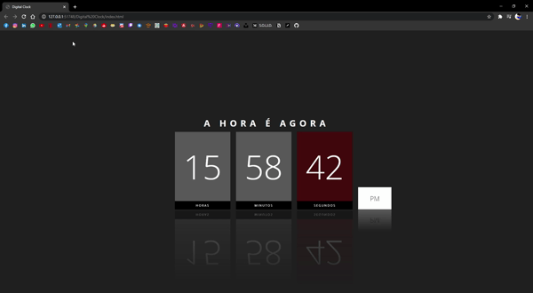

<h1 align="center">
Digital Clock
</h1>

CSS TRICKS for study purposes.

Made only with JavaScript, HTML5 and CSS3!!

Click <a href="https://www.youtube.com/watch?v=CWOnjWTfPW4&t=0s">here</a> and <a href="https://www.youtube.com/watch?v=fSYG0xZIc8A&t=0s">here</a> for the youtube video, watch how it is made and do it yourself.

<h1 align="center">
Preview
</h1>

  

## Resources

- <a href="https://www.w3schools.com/html/">HTML</a>
- <a href="https://www.w3schools.com/css/default.asp">CSS</a>
- <a href="https://www.w3schools.com/js/default.asp">JavaScript</a>

## Start Dev Environment for VSCode

1. Open project folder in `VSCode`
2. Install `Watch in Chrome` extension
3. In `index.html` press Ctrl+Shift+P > `Watch in Chrome`
4. Access the **generated address** in your browser 🚀
